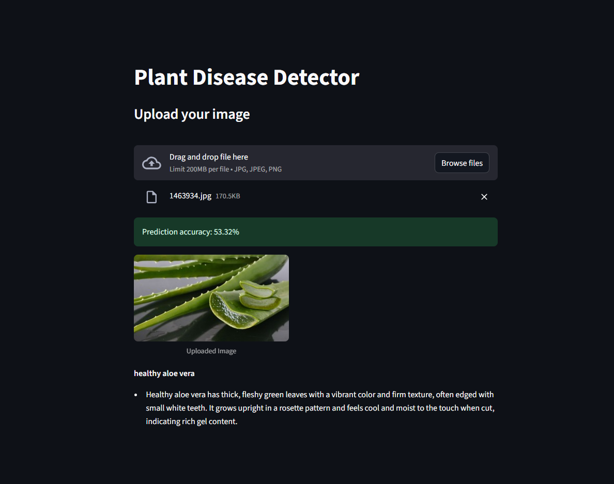

# Plant Disease Detection App
## Description
This application uses deep learning (MobileNetV2) to detect plant diseases from leaf images. It is designed for educational and experimental purposes and may not be highly accurate due to limited training data.
Detection of plant diseases should be done at the right time and in the right quantity to ensure crop health and food security by minimizing losses that occur through crop yield reductions. Conventional models of diagnosis tend to be manual, labor-intensive and rely on expert staffing, and are thus time consuming in terms of fast large-scale implementation or indoor plants. This paper contains the entire pipeline of real-time plant disease classification with transfer learning of MobileNetV2 based on the New Plant Diseases Dataset (Augmented) Dataset from Kaggle. The proposed system includes threaded preprocessing, norm of an image, even splitting between the classes, and augmentation followed by fine-tuning MobileNetV2 that are pretrained on ImageNet. The model is embedded on to Streamlit web application that will receive the user image upload, make predictions along with the softmax confidence scores and gather the curated descriptions of the diseases and the treatment ideas through API. This prototype has model accuracy of 99.1%, F1-score of 94.6%, Precision 95.7%, and Recall 94.37%.



## Dataset
Get the original dataset here: [https://www.kaggle.com/datasets/itselif/comprehensive-plant-disease-dataset]

## Requirements
- Python 3.x
- PyTorch, torchvision, streamlit, PIL
- A GPU is recommended for faster training and inference, but CPU will also work.

## Note
- Before running the program, make sure to adjust the number of workers based on the number of CPU cores available on your machine. This ensures optimal performance and resource utilization.
## Setup Instructions
1. Download the GitHub Repository
   
   - Clone or download this repository to your local machine.
   - Run:
     ```
     git clone https://github.com/darshanbalajitd/plant-disease-recognition.git
     ```
2. Preprocess the Data
   
   - Edit the paths in pre-processing.py to match your dataset location.
   - Run:
     ```
     python pre-processing.py
     ```
3. Train the Model
   
   - Edit the paths in train_MobileNetV2.py as needed.
   - Run:
     ```
     python train_MobileNetV2.py
     ```
4. Start the App
   
   - Edit the paths in app.py if necessary.
   - Run the app using Streamlit:
     ```
     streamlit run app.py
     ```
## Usage Tips
- For best results, upload a clear image of a single leaf.
- The prediction accuracy may be limited due to the small training dataset.
- Results are for demonstration and may not be suitable for real-world diagnosis.
